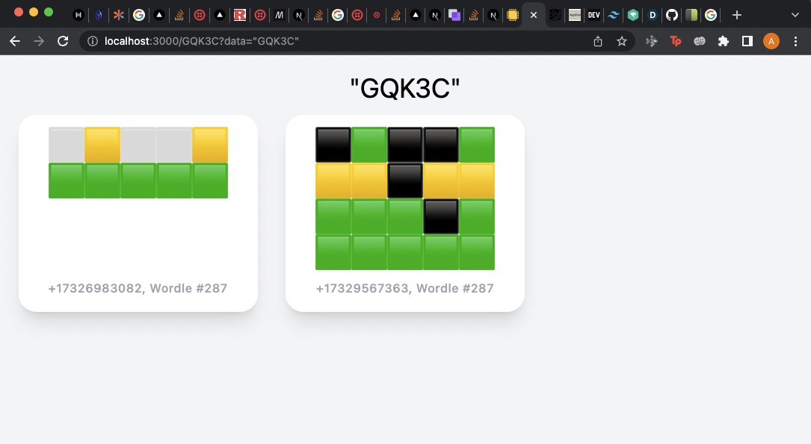

<h1 align="center">Schwordle</h1>

<p align="center">


</p>

A Vue.js wrapper for the beautiful date-range picker made by the **[Baremetrics](https://baremetrics.com)** team._

---


Have you and your friends been obsessed with wordle recently? Itching for the new wordle at 12 am? Schwordle comes with an interactive dashboard that encapsulates the best of your wordle successes!

### Background

My friend Ayush Patel told me that there was a hackathon at Rutgers and it would have a lot of prizes so I decided to sign up on a whim. We were just chilling during the hackathon just thinking about what kind of project we could make when suddenly my friend, Dhruv Ghoniya, texted this to our groupchat:

Wordle 287 2/6

⬜🟨⬜⬜🟨 \n
🟩🟩🟩🟩🟩


We had a group chat and anywhere from 12 - 1 am, a bunch of wordles would come through and we wanted to elevate this experience and see how we compared to everyone. It came out of thin air that I just wanted to see a place to see all of our wordles together without having to scroll through a groupchat. I was also wondering who was the best and like what kind of statistics we can come up with. We saw some potential free prizes and we told ourselves we have to get that Twilio prize. With an idea and just a day to code, we went right at it. We created schwordle, an all inclusive .....

# Installation

First, create a .env file with the following information:
```
TWILIO_ACCOUNT_SID=...
TWILIO_AUTH_TOKEN=...
TWILIO_NUMBER=...
DATABASE_URL=...
```

To begin, run the program locally in the front-end directory

`npm run dev`

In another terminal, run ngrok as such: 

`ngrok html 3000`

Now, with the routed URL we see in ngrok, put the URL as the URL for the webhook for the number you want to be responding to in your twilio account.

# Images of a dashboard!

